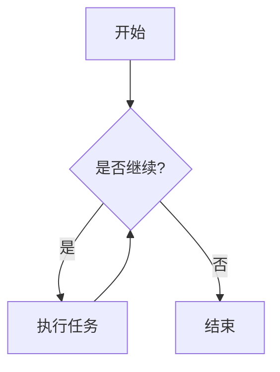

# doXmind-Local 用户指南

## 目录

1. [应用程序简介](#1-应用程序简介)
2. [开始使用](#2-开始使用)
3. [文档编辑功能](#3-文档编辑功能)
4. [AI 功能](#4-ai-功能)
5. [文件和工作区管理](#5-文件和工作区管理)
6. [聊天和对话管理](#6-聊天和对话管理)
7. [版本控制和历史记录](#7-版本控制和历史记录)
8. [导出功能](#8-导出功能)
9. [设置和配置](#9-设置和配置)
10. [界面导航](#10-界面导航)
11. [高级功能](#11-高级功能)
12. [快捷键和技巧](#12-快捷键和技巧)
13. [故障排除](#13-故障排除)

---

## 1. 应用程序简介

### 什么是 doXmind-Local？

doXmind-Local 是一款强大的 **本地 AI 驱动的写作和文档编辑平台**，结合了现代富文本编辑器的功能与先进的 AI 助手能力。它允许您在本地环境中创建、编辑和管理文档，同时利用 AI 技术提升写作效率。

### 核心特性

- **智能文档编辑器**：基于 TipTap 的富文本编辑器，支持 Markdown 和多种格式
- **AI 写作助手**：实时 AI 对话、智能编辑建议、自动补全
- **多格式支持**：原生支持 Markdown，可导入/导出 PDF、DOCX、HTML 等格式
- **版本控制**：完整的文档历史记录和变更追踪
- **高级内容**：支持数学公式、图表、流程图、代码块、表格等
- **本地优先**：所有数据存储在本地，保护隐私安全
- **工作区管理**：组织多个文档和项目的完整工作区系统

### 技术架构

- **前端框架**：Vue 3 + TypeScript
- **编辑器引擎**：TipTap（基于 ProseMirror）
- **AI 集成**：支持流式响应和工具调用
- **存储方式**：本地文件系统 + 后端 API

---

## 2. 开始使用

### 2.1 欢迎页面

当您首次打开 doXmind-Local，您会看到**欢迎页面**，包含以下功能：

#### 主要区域

1. **搜索栏**（顶部中央）
   - 快速搜索您的所有文档
   - 支持按文档标题搜索

2. **设置按钮**（右上角齿轮图标）
   - 点击进入应用程序设置界面

3. **主题切换**（右上角）
   - 切换浅色/深色主题

4. **窗口控制**（右上角，仅桌面应用）
   - 最小化、最大化、关闭窗口

#### 创建新文档

在"Start a new document"部分，您可以：

**创建空白文档**
- 点击第一个"Blank document"卡片
- 立即开始编辑新文档

**使用模板创建**
- 选择预设模板：
  - **Brochure**（宣传册）
  - **Project proposal**（项目提案）
  - **Business letter**（商务信函）
  - **Resume**（简历，多种风格）
  - **Letter**（信件）
- 点击模板卡片即可基于模板创建文档

#### 导入现有文件

点击右上角的 **"Open"** 下拉菜单：

1. **Open file**（打开文件）- 快捷键：`Ctrl+O`
   - 导入单个文件
   - 支持格式：`.pdf`, `.md`, `.markdown`, `.docx`, `.pptx`, `.csv`, `.xlsx`
   - 文件会自动转换为 Markdown 格式（如适用）

2. **Open folder**（打开文件夹）- 快捷键：`Ctrl+Shift+O`
   - 导入整个文件夹
   - 所有支持的文件将被导入到新工作区
   - 自动过滤不支持的文件类型

#### 拖拽上传

您还可以直接**拖拽文件或文件夹**到窗口中：
- 拖动时会显示半透明的上传覆盖层
- 释放文件即可自动创建工作区并导入

### 2.2 最近文档

在"Recent documents"部分查看和管理您的文档：

#### 视图模式

- **网格视图**（Grid）：卡片式显示，包含文档预览
- **列表视图**（List）：紧凑的列表显示

#### 排序选项

点击排序下拉菜单选择：
- **Owned by me**（我拥有的）
- **Last opened by me**（最近打开）
- **Last modified by me**（最近修改）
- **Title**（标题）

#### 文档操作

在文档卡片上悬停，点击 **⋮** 菜单：
- **Rename**（重命名）：修改文档标题
- **Remove**（删除）：删除文档
- **Make a copy**（复制）：创建副本

---

## 3. 文档编辑功能

### 3.1 富文本编辑器

doXmind-Local 提供功能强大的富文本编辑器，支持以下基本格式：

#### 文本格式化

通过**工具栏**或**快捷键**应用格式：

| 功能 | 工具栏按钮 | 快捷键 |
|------|------------|--------|
| **粗体** | **B** | `Ctrl+B` |
| **斜体** | *I* | `Ctrl+I` |
| **下划线** | U | `Ctrl+U` |
| **删除线** | ~~S~~ | - |
| **代码** | `<>` | `Ctrl+E` |
| **高亮** | 标记 | - |

#### 段落格式

| 格式 | 工具栏 | 快捷键 |
|------|--------|--------|
| 标题 1 | H1 | `Ctrl+Alt+1` |
| 标题 2 | H2 | `Ctrl+Alt+2` |
| 标题 3-6 | H3-H6 | `Ctrl+Alt+3-6` |
| 正文 | ¶ | `Ctrl+Alt+0` |
| 引用块 | " " | `Ctrl+Shift+B` |

#### 列表

| 列表类型 | 工具栏 | 快捷键 |
|----------|--------|--------|
| 无序列表 | • | `Ctrl+Shift+8` |
| 有序列表 | 1. | `Ctrl+Shift+7` |
| 任务列表 | ☑ | - |

#### 对齐方式

- 左对齐
- 居中对齐
- 右对齐
- 两端对齐

### 3.2 高级内容功能

#### 代码块

**插入代码块**：
1. 点击工具栏 `</>` 图标
2. 或输入 ` ```语言 ` 后按回车
3. 支持语法高亮（JavaScript、Python、Java 等）

```javascript
// 示例代码块
function hello() {
  console.log("Hello, doXmind!");
}
```

#### 数学公式（LaTeX）

**行内公式**：
- 工具栏选择 **∑** → "Inline Math"
- 或使用快捷语法：`$公式$`
- 示例：$E = mc^2$

**块级公式**：
- 工具栏选择 **∑** → "Block Math"
- 或使用 `$$公式$$`
- 示例：
$$
\int_{a}^{b} f(x)dx = F(b) - F(a)
$$

**编辑公式**：
- 点击已有公式打开编辑对话框
- 实时预览 LaTeX 渲染效果

#### 流程图和图表（Mermaid）

**插入 Mermaid 图表**：
1. 点击工具栏 **Mermaid** 图标
2. 或创建代码块，语言选择 `mermaid`

**支持的图表类型**：
- **流程图**（Flowchart）
- **序列图**（Sequence Diagram）
- **甘特图**（Gantt Chart）
- **类图**（Class Diagram）
- **状态图**（State Diagram）
- **饼图**（Pie Chart）

**示例 - 流程图**：


**转换代码块为图表**：
- 导航栏 → **⋮** 菜单 → "Convert Mermaid Blocks"
- 将所有 Mermaid 代码块转换为可视化图表

#### 数据可视化图表（ECharts）

**插入交互式图表**：
1. 点击工具栏 **📊** 图标
2. 配置图表选项（折线图、柱状图、饼图等）
3. 图表支持交互式缩放、悬停提示

**支持的图表**：
- 折线图
- 柱状图
- 饼图
- 散点图
- 雷达图
- 更多 Apache ECharts 支持的图表

#### 电子表格表格

**插入表格**：
1. 点击工具栏 **表格** 图标
2. 选择行列数
3. 或使用 JSpreadsheet 高级表格

**表格操作**（选中表格时显示浮动菜单）：
- 添加/删除行
- 添加/删除列
- 合并单元格
- 设置表头
- 删除表格

#### 图片

**插入图片**：
1. 点击工具栏 **🖼️** 图标
2. 选择本地图片文件
3. 或拖拽图片到编辑器

**图片操作**：
- **调整大小**：拖动图片边角
- **对齐方式**：左、中、右对齐
- **删除**：选中后按 Delete 键

#### 链接

**插入链接**：
1. 选中文本
2. 点击工具栏 **🔗** 图标
3. 输入 URL
4. 或使用快捷键 `Ctrl+K`

**编辑链接**：
- 点击已有链接打开浮动菜单
- 可编辑 URL 或移除链接

### 3.3 编辑器菜单

#### 工具栏（顶部）

固定工具栏包含所有常用格式化工具：
- 文本格式按钮
- 段落格式下拉菜单
- 列表工具
- 插入功能（链接、图片、表格、代码等）
- 对齐工具

#### 浮动菜单（Bubble Menu）

选中文本时自动出现：
- 快速格式化（粗体、斜体、链接）
- AI 功能（"Ask AI"）
- 复制/粘贴

#### 块级菜单（Floating Menu）

在空行输入 `/` 触发：
- 快速插入标题、列表、代码块
- 插入高级内容（图表、公式、表格）
- 快捷命令菜单

#### 拖拽手柄（Drag Handle）

每个段落左侧的 **⋮⋮** 图标：
- 拖动重新排序块
- 点击显示块菜单
- 快速访问块操作

---

## 4. AI 功能

### 4.1 AI 聊天助手

doXmind-Local 内置强大的 AI 助手，支持实时对话和文档编辑。

#### 打开聊天面板

**方法 1**：点击右上角 **聊天图标**
**方法 2**：快捷键（如配置）

聊天面板会从右侧滑出，包含：
- 对话历史
- 输入框
- 命令模式选择
- 附件功能

#### 发送消息

1. 在底部输入框输入问题或指令
2. 按 **Enter** 发送（Shift+Enter 换行）
3. AI 会实时流式响应

#### AI 响应特性

**流式响应**：
- AI 回答实时显示，逐字生成
- 思考过程可视化（显示 AI 推理步骤）
- 工具调用实时显示

**消息状态**：
- **⏳ Pending**：等待响应
- **📝 Streaming**：正在生成
- **✅ Complete**：完成
- **❌ Error**：错误（可点击重试）

### 4.2 AI 命令模式

在聊天输入框上方选择 AI 的工作模式：

#### Ask 模式（问答）

**用途**：向 AI 提问，获取解释、建议、信息

**示例**：
- "解释量子计算的基本原理"
- "这段代码有什么问题？"
- "推荐三本关于机器学习的书"

**特点**：
- AI 不会修改文档
- 纯粹的对话交流
- 适合研究和学习

#### Edit 模式（编辑）

**用途**：让 AI 直接编辑您的文档内容

**工作流程**：
1. （可选）选中要编辑的文本
2. 切换到 Edit 模式
3. 描述您想要的修改
4. AI 会高亮显示修改内容
5. 接受或拒绝修改

**示例**：
- "让这段话更专业"
- "修正语法错误"
- "重写这段，使其更简洁"

**特点**：
- 实时 diff 高亮显示
- 接受/拒绝编辑界面
- 支持多轮迭代

#### Write 模式（写作）

**用途**：让 AI 帮您撰写新内容

**示例**：
- "写一段关于公司价值观的介绍"
- "创建一个项目计划大纲"
- "生成产品功能列表"

**特点**：
- AI 生成全新内容
- 可直接插入到文档
- 适合内容创作

### 4.3 文本选择与 AI 编辑

#### 快速编辑（Quick Edit）

**使用步骤**：
1. 在文档中**选中文本**
2. 浮动菜单出现，点击 **"Ask AI"** 或快捷图标
3. 或右键菜单选择 AI 选项

**快速操作**：
- **Improve**：改进文本
- **Make shorter**：缩短
- **Make longer**：扩展
- **Fix grammar**：修正语法
- **Change tone**：调整语气

#### 多选功能

您可以选择**多个文本段落**进行批量编辑：

1. 选中第一段文本 → 点击"Add to selection"
2. 选中第二段文本 → 再次"Add to selection"
3. 在聊天面板查看所有选中片段
4. 发送编辑指令，AI 会处理所有选中内容

**选中片段管理**：
- 在聊天输入框上方查看所有选中片段
- 点击 ✕ 移除单个片段
- 点击"Clear all"清除所有选中

### 4.4 接受/拒绝 AI 编辑

当 AI 完成编辑后，编辑器中会显示**高亮的修改**：

#### 查看修改

- **绿色高亮**：新增内容
- **红色删除线**：删除内容
- **黄色高亮**：修改内容

#### 接受修改

点击屏幕底部出现的 **"Accept & Save"** 按钮：
- 所有修改立即应用
- 清除高亮标记
- 自动保存文档

#### 拒绝修改

点击 **"Reject"** 按钮：
- 恢复到修改前的内容
- 清除所有高亮
- AI 编辑被撤销

### 4.5 AI 自动补全

**启用位置**：导航栏 → AI 图标 → 开关

**工作方式**：
- 在编辑时，AI 会根据上下文建议后续文本
- 半透明显示建议内容
- 按 **Tab** 接受建议
- 继续输入忽略建议

**配置**：
- 可在设置中调整触发延迟
- 可完全禁用自动补全

### 4.6 附加文件到对话

在聊天输入框中添加文件上下文：

1. 点击输入框左侧的 **📎** 图标
2. 选择要附加的文件
3. 文件内容会作为上下文发送给 AI
4. AI 可以引用文件内容回答问题

**支持的文件类型**：
- 文本文件（.txt, .md）
- 代码文件（.js, .py, .java 等）
- 数据文件（.csv, .json）
- 文档文件（.pdf, .docx - 会先转换）

### 4.7 @ 提及功能

在聊天输入框中输入 `@` 触发提及菜单：

**提及类型**：
- **@文档名**：引用工作区中的其他文档
- **@文件名**：引用已上传的文件
- **@选中文本**：引用当前选中的文本片段

AI 会将提及的内容作为上下文理解您的问题。

---

## 5. 文件和工作区管理

### 5.1 工作区概念

**工作区（Workspace）** 是 doXmind-Local 中组织文档和文件的容器：

- 每个工作区包含多个文档和文件
- 工作区有独立的对话历史
- 工作区有独立的文件管理

### 5.2 创建工作区

**自动创建**：
- 创建新文档时自动创建工作区
- 导入文件/文件夹时自动创建工作区

**工作区命名**：
- 基于第一个文档名称
- 可随时重命名

### 5.3 文件上传

#### 上传单个文件

1. 在文档编辑界面，点击侧边栏的 **文件管理器**
2. 点击 **"Upload"** 按钮
3. 选择文件
4. 文件会自动上传并显示在文件列表

#### 上传多个文件

1. 点击"Upload"后按住 Ctrl 选择多个文件
2. 或直接拖拽多个文件到文件管理器

#### 支持的文件格式

**数据文件**：
- CSV（逗号分隔值）
- JSON（JavaScript 对象表示法）
- Parquet（列式存储格式）
- TSV（制表符分隔值）
- XLS / XLSX（Excel 表格）
- XML（可扩展标记语言）

**写作文件**：
- MD / Markdown（Markdown 文档）

**文档文件**（自动转换为 Markdown）：
- PDF（便携式文档格式）
- DOCX（Word 文档）
- PPTX（PowerPoint 演示文稿）

**其他**：
- 图片文件（PNG, JPG, GIF, SVG）
- 代码文件（.js, .py, .java 等）
- 文本文件（.txt）

### 5.4 文件自动转换

当上传 **PDF、DOCX、PPTX** 文件时：

1. 后端自动提取文本内容
2. 转换为 Markdown 格式
3. 创建对应的 `.md` 文件
4. 原文件和转换后的文件都会保存

**示例**：
- 上传 `报告.pdf`
- 生成 `报告.md`（可编辑的 Markdown 版本）
- 两个文件都可在文件管理器中访问

### 5.5 文件管理操作

#### 查看文件

在左侧**工作台侧边栏**查看所有文件：
- 按类型分类（写作文件、数据文件、其他）
- 显示文件大小和修改时间
- 点击文件名打开

#### 重命名文件

1. 右键点击文件
2. 选择 **"Rename"**
3. 输入新名称
4. 按 Enter 确认

#### 删除文件

1. 右键点击文件
2. 选择 **"Delete"**
3. 确认删除

**注意**：删除操作不可恢复，请谨慎操作。

#### 文件内容查看

点击文件可以：
- **Markdown 文件**：在编辑器中打开
- **数据文件**：显示预览或元数据
- **图片**：显示预览
- **代码文件**：语法高亮显示

### 5.6 文档大纲

在文档编辑界面，左侧边栏显示**文档大纲**：

**功能**：
- 自动提取所有标题（H1-H6）
- 显示文档结构树
- 点击标题快速跳转
- 折叠/展开章节

**大纲导航**：
- 当前查看的标题会高亮显示
- 滚动文档时自动更新高亮

---

## 6. 聊天和对话管理

### 6.1 开始新对话

**清空当前对话**：
1. 点击聊天面板顶部的 **"New Chat"** 按钮
2. 或点击 **🗑️** 清除图标
3. 确认清除所有消息

**效果**：
- 清空聊天历史
- 重置对话上下文
- 开始全新对话

### 6.2 加载历史对话

查看和恢复之前的对话：

#### 打开历史记录

1. 点击聊天面板顶部的 **"History"** 或 **⏱️** 图标
2. 显示该工作区的所有历史对话

#### 对话列表

历史记录显示：
- 对话标题（基于首条消息自动生成）
- 对话时间
- 消息数量

#### 加载对话

1. 点击任一历史对话
2. 对话内容会加载到聊天面板
3. 可以继续该对话或查看内容

### 6.3 对话上下文管理

#### 附加数据（Additional Data）

在对话中引用之前的消息：

1. 在历史消息上点击 **"Add to context"** 或 **📌** 图标
2. 该消息会被标记为"附加数据"
3. AI 会在后续回复中参考这些消息

**用途**：
- 引用重要信息
- 保持长对话的上下文连贯性
- 跨对话引用内容

#### 移除附加数据

1. 在聊天输入框上方查看附加数据列表
2. 点击 ✕ 移除不需要的消息

### 6.4 消息操作

每条 AI 消息都有多种操作选项：

#### 复制内容

点击消息右上角的 **"Copy"** 或 **📋** 图标：
- 复制消息文本到剪贴板
- 可粘贴到文档或其他应用

#### 复制到输入框

点击 **"Copy to Input"**：
- 将消息内容复制到聊天输入框
- 可编辑后重新发送

#### 保存到文档

点击 **"Save to Document"** 或 **💾** 图标：
- AI 生成的内容直接插入到当前文档
- 插入位置：光标位置或文档末尾

#### 重试（Retry）

如果 AI 响应出错或不满意：
1. 点击消息的 **"Retry"** 或 **🔄** 图标
2. 使用相同的问题重新请求 AI

### 6.5 工具调用可视化

当 AI 使用工具时（如搜索、计算、代码执行），会显示：

**工具调用卡片**：
- 工具名称和图标
- 工具输入参数
- 工具执行结果
- 状态（运行中/完成/失败）

**Cursor 风格显示**：
- 清晰的视觉分隔
- 可折叠的详细信息
- 实时状态更新

### 6.6 思考过程显示

AI 思考时会显示：

- **思考中**标志（💭 图标）
- 思考时间计时器
- 思考内容（如模型支持）

**用途**：
- 了解 AI 的推理过程
- 调试复杂问题
- 学习 AI 如何解决问题

---

## 7. 版本控制和历史记录

### 7.1 执行历史

doXmind-Local 会记录所有 AI 对文档的修改操作。

#### 打开历史记录

**方法 1**：工作台侧边栏 → **"History"** 标签
**方法 2**：聊天面板 → 历史图标 → 查看执行历史

#### 历史记录内容

每条执行记录包含：
- **执行时间**：何时执行
- **操作类型**：编辑、写作、问答
- **影响的文件**：修改了哪些文档
- **文件变更统计**：添加/删除的行数
- **AI 响应摘要**

### 7.2 文件变更对比（Diff Viewer）

查看 AI 修改的具体内容：

#### 打开 Diff 查看器

1. 在执行历史中选择一条记录
2. 点击 **"View Changes"** 或 **"Show Diff"**
3. 显示 VS Code 风格的差异对比

#### Diff 显示

**统一差异格式**：
- **绿色 `+`**：新增的行
- **红色 `-`**：删除的行
- 上下文行：未修改的行（灰色）

**文件列表**：
- 左侧显示所有修改的文件
- 每个文件显示 +/-行数统计
- 点击文件名查看该文件的详细 diff

### 7.3 恢复到之前版本（Restore）

撤销 AI 的修改，恢复到执行前的状态：

#### 执行恢复

1. 在执行历史中选择要恢复的执行记录
2. 点击 **"Restore"** 按钮
3. 确认操作

**效果**：
- 所有修改的文件恢复到执行前的内容
- 文档内容回退
- 创建新的检查点

**警告**：
- 恢复操作会覆盖当前内容
- 建议查看 Diff 后再恢复
- 恢复后的状态可以通过"Reapply"重新应用

### 7.4 重新应用更改（Reapply）

在恢复后，重新应用之前的修改：

#### 执行 Reapply

1. 在执行历史中找到已恢复的执行
2. 点击 **"Reapply"** 按钮
3. 确认操作

**效果**：
- 重新应用该执行的所有修改
- 文档内容更新为修改后的版本
- 可多次恢复/重新应用切换

**用途**：
- 在不同版本间快速切换
- 比较修改前后的效果
- 撤销误操作的恢复

### 7.5 检查点系统

应用内部的版本控制机制：

#### 自动检查点

系统会在以下时机自动创建检查点：
- AI 编辑前
- 重要操作前
- 手动保存时

#### 检查点内容

每个检查点包含：
- 完整的文档内容快照
- 创建时间戳
- 操作描述

#### 检查点操作

在聊天历史中：
- 每条编辑消息都关联一个检查点
- 点击 **"Restore checkpoint"** 恢复到该消息前的状态
- 检查点链式追踪，可回退到任意编辑前

### 7.6 恢复到对话开始

快速回到对话最开始的文档状态：

1. 在聊天面板菜单中选择 **"Restore to Beginning"**
2. 确认操作

**效果**：
- 清除所有 AI 编辑
- 恢复到对话开始前的文档内容
- 清空聊天历史（可选）

---

## 8. 导出功能

### 8.1 导出文档

将您的文档导出为多种格式：

#### 打开导出对话框

**方法 1**：导航栏 → **"Export"** 按钮
**方法 2**：文档菜单 → **"Export"**

#### 选择导出格式

支持的格式：

1. **Markdown (.md)**
   - 原生格式
   - 保留所有 Markdown 标记
   - 适合版本控制和纯文本编辑

2. **HTML (.html)**
   - 网页格式
   - 包含样式和格式
   - 可在浏览器中打开

3. **PDF (.pdf)**
   - 便携式文档格式
   - 适合打印和分享
   - 保留完整排版

4. **Word (.docx)**
   - Microsoft Word 格式
   - 可在 Word 中继续编辑
   - 兼容性好

5. **Plain Text (.txt)**
   - 纯文本格式
   - 移除所有格式
   - 最小文件大小

### 8.2 导出选项

根据格式不同，可能包含以下选项：

#### PDF 导出选项

- 页面大小（A4、Letter 等）
- 页边距
- 页眉/页脚
- 目录生成

#### Word 导出选项

- 样式模板
- 标题编号
- 图片质量

#### HTML 导出选项

- 包含 CSS 样式
- 独立 HTML 文件
- 图片嵌入方式

### 8.3 导出过程

1. 选择格式和选项
2. 点击 **"Export"** 按钮
3. 选择保存位置
4. 等待导出完成
5. 显示成功通知

### 8.4 批量导出

导出整个工作区的所有文档：

1. 在工作区菜单中选择 **"Export All"**
2. 选择导出格式
3. 选择保存文件夹
4. 所有文档会以相同格式批量导出

---

## 9. 设置和配置

### 9.1 打开设置

**方法 1**：点击右上角 **⚙️ 齿轮图标**
**方法 2**：欢迎页面 → 设置按钮

### 9.2 常规设置（General）

#### 语言（Language）

选择界面语言：
- 简体中文
- English
- 其他支持的语言

#### 自动保存（Auto-save）

- **启用/禁用**自动保存
- **自动保存间隔**：设置保存频率（秒）
- **保存指示器**：显示保存状态

#### 工作区文件夹路径（Workspace Folder Path）

设置工作区文件的本地存储位置：
1. 点击 **"Browse"** 浏览文件夹
2. 选择本地目录
3. 点击 **"Apply"** 应用更改

**注意**：更改路径后，现有工作区不会自动移动，需要手动迁移。

### 9.3 外观设置（Appearance）

#### 主题（Theme）

选择应用主题：

- **Light**（浅色）：明亮主题，适合白天使用
- **Dark**（深色）：暗色主题，减少眼睛疲劳
- **System**（系统）：跟随操作系统设置自动切换

#### 字体设置

- **编辑器字体**：选择编辑器字体家族
- **字体大小**：调整文本大小
- **行高**：设置行间距

#### 界面密度

- **Compact**（紧凑）：节省空间
- **Normal**（正常）：默认间距
- **Comfortable**（舒适）：更大间距

### 9.4 AI 模型设置（Model）

#### Agent 模式

选择 AI 的工作模式：

- **Default (Fast)**
  - 快速响应
  - 适合日常对话和简单编辑
  - 低延迟

- **Max (Maximum Reasoning)**
  - 深度思考
  - 适合复杂问题和长篇写作
  - 更详细的推理过程
  - 响应时间较长

#### 模型参数（如适用）

- **Temperature**：控制响应的创造性
  - 低值（0.0-0.5）：更确定性、保守
  - 高值（0.5-1.0）：更有创造性、多样化
- **Max Tokens**：单次响应的最大长度

### 9.5 隐私设置（Privacy）

#### 数据收集

- **启用/禁用**匿名使用数据收集
- **崩溃报告**：自动发送错误报告
- **性能数据**：收集性能指标

#### API 日志

- **记录 API 请求**：保存所有 API 调用日志（用于调试）
- **日志存储期限**：设置日志保留时间

#### 本地存储

- **缓存管理**：清除应用缓存
- **数据导出**：导出所有本地数据
- **数据清除**：重置应用数据（谨慎操作）

### 9.6 保存设置

- 大多数设置更改会**自动保存**
- 关键设置（如工作区路径）需要点击 **"Apply"** 或 **"Save"**
- 某些设置可能需要**重启应用**才能生效

---

## 10. 界面导航

### 10.1 主界面布局

doXmind-Local 的界面分为以下区域：

```
┌─────────────────────────────────────────────────────────┐
│  导航栏（Navigation Bar）                                   │
├──────┬─────────────────────────────────┬────────────────┤
│      │                                 │                │
│ 工作台 │       主编辑区域                  │   聊天面板       │
│ 侧边栏 │    （Editor / Session）          │  （可折叠）      │
│      │                                 │                │
│      │                                 │                │
│ - 文档 │                                 │                │
│ - 文件 │                                 │                │
│ - 历史 │                                 │                │
│      │                                 │                │
└──────┴─────────────────────────────────┴────────────────┘
```

### 10.2 导航栏（Navigation Bar）

位于顶部的主导航栏包含：

#### 左侧

- **doXmind Logo**：点击返回主页
- **文档标题**：显示当前文档名（可点击重命名）
- **自动保存状态**：
  - ✓ Saved（已保存）
  - 💾 Saving...（保存中）
  - 📝 Unsaved changes（未保存）

#### 中间

- **文档切换器**（Documents）
  - 下拉菜单显示所有打开的文档
  - 快速切换文档
  - 显示最近使用的文档

#### 右侧

- **AI 自动补全开关**：切换 AI 补全功能
- **保存按钮**：手动保存文档
- **导出按钮**：导出当前文档
- **更多菜单（⋮）**：
  - 转换 Mermaid 代码块
  - 文档设置
  - 其他操作
- **聊天面板切换**：显示/隐藏聊天面板
- **设置按钮**：打开设置页面
- **窗口控制**（桌面应用）：最小化、最大化、关闭

### 10.3 工作台侧边栏（Workbench Sidebar）

左侧可折叠侧边栏，包含多个标签：

#### Documents 标签

- **文档列表**：显示工作区中的所有 Markdown 文档
- **新建文档**：点击 + 按钮创建新文档
- **文档操作**：
  - 点击文档名打开
  - 右键菜单：重命名、删除、复制

#### Files 标签

- **文件管理器**：浏览工作区中的所有文件
- **文件分类**：
  - Writing Files（Markdown）
  - Data Files（CSV、JSON 等）
  - Other Files
- **文件操作**：
  - 上传文件
  - 查看、重命名、删除文件

#### History 标签

- **执行历史**：查看所有 AI 操作记录
- **时间线视图**：按时间排序的执行列表
- **快速操作**：
  - 查看变更
  - 恢复（Restore）
  - 重新应用（Reapply）

#### 折叠/展开

- 点击侧边栏顶部的 **◀** 或 **▶** 图标折叠/展开
- 折叠后仅显示图标
- 快捷键：`Ctrl+B`（如配置）

### 10.4 文档大纲（Document Outline）

在文档编辑模式下，左侧显示文档大纲：

#### 功能

- **自动提取标题**：H1-H6 标题自动生成大纲
- **层级结构**：显示标题的嵌套关系
- **快速导航**：点击标题跳转到对应位置
- **折叠/展开**：折叠章节隐藏子标题

#### 当前位置指示

- 滚动文档时，大纲中高亮显示当前查看的标题
- 自动滚动大纲以保持当前标题可见

### 10.5 主编辑区域

中央的主要工作区：

#### 文档编辑模式

- **编辑器**：富文本编辑器
- **工具栏**：格式化工具
- **浮动菜单**：选中文本时出现
- **块级菜单**：输入 / 触发

#### 会话模式（Session Mode）

当导航到 `/session/:sessionId` 时：
- **文档卡片网格**：显示工作区中的所有文档
- **知识库**：显示关联的数据和文件
- **聊天面板**：嵌入到右侧（不可折叠）

### 10.6 聊天面板（Chat Panel）

右侧可折叠的 AI 聊天面板：

#### 顶部

- **标题**："AI Assistant" 或对话标题
- **新对话按钮**：清空当前对话
- **历史按钮**：查看对话历史
- **关闭按钮**：折叠面板

#### 中间

- **消息列表**：滚动查看所有消息
- **用户消息**：您发送的消息（右对齐）
- **AI 消息**：AI 响应（左对齐）
- **系统消息**：通知和状态

#### 底部

- **命令模式选择器**：Ask / Edit / Write
- **附加数据显示**：引用的消息和文件
- **选中文本显示**：当前选中的文本片段
- **输入框**：输入消息或指令
- **附件按钮**：添加文件附件
- **发送按钮**：发送消息（或按 Enter）

### 10.7 快捷导航

#### 面包屑导航（Breadcrumbs）

某些视图显示面包屑：
```
Home > Workspace Name > Document Name
```
点击任一层级快速返回。

#### 文档切换器

导航栏中的文档切换器：
- 显示当前文档名
- 点击下拉显示所有文档
- 支持搜索过滤
- 最近使用的文档排在前面

---

## 11. 高级功能

### 11.1 流式 AI 响应

doXmind-Local 使用 Server-Sent Events (SSE) 实现实时流式响应：

#### 优势

- **实时反馈**：逐字显示 AI 响应，无需等待全部完成
- **低延迟**：感知速度更快
- **可中断**：随时停止生成

#### 工作原理

1. 发送消息到 AI
2. 建立 SSE 连接
3. AI 逐块发送响应内容
4. 前端实时渲染
5. 完成后关闭连接

#### 取消流式响应

- 点击消息旁边的 **"Stop"** 或 **⏹️** 按钮
- 已生成的内容会保留
- 可以重新发送或修改问题

### 11.2 工具调用系统

AI 可以调用工具来增强能力：

#### 支持的工具

- **文件读取**：读取工作区文件内容
- **文件写入**：创建或修改文件
- **搜索**：在文档中搜索
- **代码执行**：运行代码片段（如启用）
- **计算**：执行数学计算
- **网络搜索**：搜索在线信息（如启用）

#### 工具调用显示

在 AI 消息中会看到工具调用卡片：

```
┌─────────────────────────────────┐
│ 🔧 Tool: Read File               │
├─────────────────────────────────┤
│ Input:                          │
│   file: "example.md"            │
├─────────────────────────────────┤
│ Output:                         │
│   [文件内容显示]                  │
└─────────────────────────────────┘
```

**Cursor 风格**：
- 清晰的视觉分隔
- 工具名称和图标
- 输入/输出分区
- 可折叠详细信息

### 11.3 思考过程可视化

当 AI 进行复杂推理时，会显示思考过程：

#### 思考指示器

```
💭 Thinking... (3.2s)
```

#### 思考内容（如模型支持）

某些高级模型会暴露内部推理：
- 分析问题
- 考虑多种方案
- 选择最佳方法

**用途**：
- 理解 AI 如何解决问题
- 学习推理方法
- 调试复杂场景

### 11.4 标题折叠功能

折叠文档中的章节以专注于特定内容：

#### 使用方法

1. 点击标题左侧的 **▼** 或 **▶** 图标
2. 折叠该标题下的所有内容
3. 再次点击展开

#### 快捷键

- `Ctrl+Shift+[`：折叠当前章节
- `Ctrl+Shift+]`：展开当前章节
- `Ctrl+Shift+0`：展开所有

#### 大纲同步

- 折叠的章节在大纲中也会显示折叠状态
- 从大纲折叠/展开会同步到编辑器

### 11.5 拖拽块级内容

重新组织文档结构：

#### 拖动段落

1. 悬停在段落左侧，出现 **⋮⋮** 拖拽手柄
2. 按住鼠标拖动段落
3. 蓝色线条指示放置位置
4. 释放鼠标完成移动

#### 可拖动的块

- 段落
- 标题
- 列表项
- 代码块
- 图片
- 表格

#### 限制

- 不能拖动到折叠的章节内
- 列表项拖动会调整缩进层级

### 11.6 多文档编辑

在同一工作区中管理多个文档：

#### 创建新文档

**方法 1**：工作台侧边栏 → Documents → **+ 按钮**
**方法 2**：导航栏 → 文档切换器 → "New Document"

#### 切换文档

**方法 1**：点击导航栏的文档切换器下拉菜单
**方法 2**：工作台侧边栏点击文档名
**方法 3**：快捷键（如配置）

#### 文档标签（未来功能）

计划支持多标签页同时打开多个文档。

### 11.7 实时协作（未来功能）

虽然当前版本主要是本地应用，但架构已为协作功能预留接口：

- 多用户编辑
- 实时同步
- 冲突解决
- 评论和注释

---

## 12. 快捷键和技巧

### 12.1 通用快捷键

| 功能 | Windows/Linux | macOS |
|------|---------------|-------|
| 保存文档 | `Ctrl+S` | `⌘+S` |
| 打开文件 | `Ctrl+O` | `⌘+O` |
| 打开文件夹 | `Ctrl+Shift+O` | `⌘+⇧+O` |
| 打开设置 | `Ctrl+,` | `⌘+,` |
| 切换主题 | `Ctrl+Shift+T` | `⌘+⇧+T` |

### 12.2 编辑器快捷键

#### 文本格式化

| 功能 | 快捷键 |
|------|--------|
| 粗体 | `Ctrl+B` |
| 斜体 | `Ctrl+I` |
| 下划线 | `Ctrl+U` |
| 代码 | `Ctrl+E` |
| 链接 | `Ctrl+K` |
| 撤销 | `Ctrl+Z` |
| 重做 | `Ctrl+Y` 或 `Ctrl+Shift+Z` |

#### 段落格式化

| 功能 | 快捷键 |
|------|--------|
| 标题 1-6 | `Ctrl+Alt+1-6` |
| 正文 | `Ctrl+Alt+0` |
| 引用块 | `Ctrl+Shift+B` |
| 无序列表 | `Ctrl+Shift+8` |
| 有序列表 | `Ctrl+Shift+7` |

#### 编辑操作

| 功能 | 快捷键 |
|------|--------|
| 查找 | `Ctrl+F` |
| 替换 | `Ctrl+H` |
| 全选 | `Ctrl+A` |
| 复制 | `Ctrl+C` |
| 剪切 | `Ctrl+X` |
| 粘贴 | `Ctrl+V` |
| 删除行 | `Ctrl+Shift+K` |
| 复制行 | `Ctrl+Shift+D` |

### 12.3 导航快捷键

| 功能 | 快捷键 |
|------|--------|
| 转到行 | `Ctrl+G` |
| 文档开头 | `Ctrl+Home` |
| 文档结尾 | `Ctrl+End` |
| 折叠章节 | `Ctrl+Shift+[` |
| 展开章节 | `Ctrl+Shift+]` |
| 折叠所有 | `Ctrl+Shift+K` |
| 展开所有 | `Ctrl+Shift+0` |

### 12.4 AI 快捷键

| 功能 | 快捷键 |
|------|--------|
| 打开 AI 聊天 | `Ctrl+Shift+A` |
| 快速编辑选中文本 | `Ctrl+Shift+E` |
| 接受 AI 建议 | `Ctrl+Enter` |
| 拒绝 AI 建议 | `Esc` |
| 触发自动补全 | `Tab` |

### 12.5 生产力技巧

#### 技巧 1：使用斜杠命令

在空行输入 `/` 快速插入内容：
- `/h1` - `/h6`：插入标题
- `/code`：插入代码块
- `/table`：插入表格
- `/math`：插入数学公式
- `/mermaid`：插入 Mermaid 图表

#### 技巧 2：Markdown 快捷语法

直接输入 Markdown 语法：
- `# 空格`：创建标题
- `- 空格` 或 `* 空格`：创建无序列表
- `1. 空格`：创建有序列表
- `> 空格`：创建引用块
- ` ``` `：创建代码块

#### 技巧 3：批量选择文本

选择多个文本段落进行统一编辑：
1. 选中第一段文本 → 右键 → "Add to selection"
2. 选中第二段文本 → 右键 → "Add to selection"
3. 切换到 Edit 模式
4. 输入编辑指令（如"改为正式语气"）
5. AI 会统一处理所有选中段落

#### 技巧 4：利用 @提及

在聊天中引用其他内容：
- `@文档名`：引用其他文档
- `@文件名`：引用已上传的文件
- 提及的内容会作为上下文发送给 AI

#### 技巧 5：使用执行历史

利用版本控制功能：
- 大胆尝试 AI 编辑，可随时恢复
- 对比不同版本的修改效果
- 在多个版本间快速切换

#### 技巧 6：自定义模板

创建常用文档模板：
1. 创建一个模板文档（如"周报模板"）
2. 需要时复制该文档
3. 基于模板快速开始

#### 技巧 7：组合使用 AI 模式

- **Ask**：先询问 AI 如何改进文档
- **Edit**：根据建议让 AI 直接编辑
- **Write**：让 AI 补充新的章节

#### 技巧 8：键盘为中心的工作流

尽量使用快捷键：
- 减少鼠标操作
- 提高编辑速度
- 保持专注

#### 技巧 9：定期查看执行历史

养成良好习惯：
- 定期查看 AI 做了哪些修改
- 学习 AI 的编辑方式
- 发现可能的错误修改

#### 技巧 10：利用文档大纲

使用大纲导航：
- 快速定位章节
- 折叠不相关内容
- 保持文档结构清晰

---

## 13. 故障排除

### 13.1 常见问题

#### 问题 1：文档无法保存

**症状**：点击保存按钮没有反应，或显示错误

**可能原因**：
- 网络连接问题（如使用远程服务器）
- 文件权限问题
- 磁盘空间不足

**解决方法**：
1. 检查自动保存状态指示器
2. 手动点击"Save"按钮
3. 检查工作区文件夹权限
4. 检查磁盘剩余空间
5. 重启应用程序

#### 问题 2：AI 响应缓慢或超时

**症状**：发送消息后长时间无响应，或显示超时错误

**可能原因**：
- 服务器负载高
- 网络连接不稳定
- 使用了 Max 模式（响应时间较长）

**解决方法**：
1. 检查网络连接
2. 切换到 Default 模式
3. 简化问题描述
4. 减少附加文件数量
5. 重试发送

#### 问题 3：文件上传失败

**症状**：拖拽文件后没有反应，或显示上传错误

**可能原因**：
- 文件格式不支持
- 文件过大
- 网络问题

**解决方法**：
1. 检查文件格式是否支持
2. 检查文件大小（建议 < 50MB）
3. 尝试使用"Open File"按钮上传
4. 分批上传大量文件
5. 查看浏览器控制台错误信息

#### 问题 4：编辑器格式化异常

**症状**：文本格式显示不正确，或编辑器卡顿

**可能原因**：
- 文档内容过大
- 复杂的格式嵌套
- 浏览器兼容性问题

**解决方法**：
1. 刷新页面（`Ctrl+R`）
2. 清除浏览器缓存
3. 拆分大文档为多个小文档
4. 简化复杂格式
5. 更新到最新版本浏览器

#### 问题 5：AI 编辑后文档混乱

**症状**：AI 编辑后文档格式错乱或内容丢失

**可能原因**：
- AI 理解错误
- 编辑冲突
- 同时进行多个编辑

**解决方法**：
1. 立即点击"Reject"拒绝修改
2. 或使用执行历史"Restore"恢复
3. 分步骤进行编辑，而非一次性大改
4. 在编辑前手动保存
5. 提供更明确的编辑指令

### 13.2 错误消息解释

#### "Failed to load document"

**原因**：文档加载失败
**解决**：
- 检查文档是否存在
- 检查文件权限
- 刷新页面重试

#### "Connection lost"

**原因**：与服务器的连接中断
**解决**：
- 检查网络连接
- 等待自动重连
- 刷新页面

#### "Invalid file format"

**原因**：上传了不支持的文件格式
**解决**：
- 检查支持的文件格式列表
- 转换文件格式后重试

#### "Workspace not found"

**原因**：工作区不存在或已被删除
**解决**：
- 返回主页选择其他工作区
- 或创建新工作区

### 13.3 性能优化建议

#### 优化 1：定期清理历史记录

- 删除不需要的旧对话
- 清理执行历史
- 减少缓存数据

#### 优化 2：避免过大的文档

- 单个文档建议 < 100KB
- 超大文档拆分为多个小文档
- 使用文档链接关联相关内容

#### 优化 3：限制同时打开的文档

- 关闭不使用的文档标签
- 定期保存并关闭文档
- 使用文档切换器管理

#### 优化 4：减少实时功能负载

- 必要时禁用 AI 自动补全
- 减少聊天面板的附加数据
- 折叠长对话历史

#### 优化 5：使用本地工作区

- 将工作区文件夹设置在本地磁盘
- 避免使用网络驱动器
- SSD 优于 HDD

### 13.4 数据备份建议

#### 自动备份

doXmind-Local 的数据存储在本地：
- 定期备份工作区文件夹
- 使用云同步服务（如 OneDrive、Google Drive）
- 设置自动备份计划

#### 手动备份

1. 找到工作区文件夹位置（设置 → General → Workspace Folder Path）
2. 复制整个文件夹到安全位置
3. 建议备份频率：每周或每次重要修改后

#### 导出备份

- 定期导出重要文档为 PDF 或 DOCX
- 保存对话历史（如需要）
- 导出设置配置

### 13.5 获取帮助

#### 内置文档

- 查看本用户指南
- 阅读应用内提示和工具提示

#### 日志和调试

如需报告问题：
1. 打开浏览器开发者工具（F12）
2. 切换到 Console 标签
3. 复制错误信息
4. 提供操作步骤复现问题

#### 联系支持

- GitHub Issues（如开源）
- 官方支持邮箱
- 社区论坛

---

## 结语

doXmind-Local 是一款功能强大的 AI 驱动写作工具，结合了现代编辑器的便利性与 AI 助手的智能。通过本指南，您应该能够：

- ✅ 熟练使用编辑器的各种功能
- ✅ 有效利用 AI 助手提升写作效率
- ✅ 管理文档、文件和工作区
- ✅ 使用版本控制功能安全地进行编辑
- ✅ 自定义应用设置以适应您的工作流程

**建议**：
- 从简单的文档开始，逐步探索高级功能
- 多尝试不同的 AI 命令模式
- 利用执行历史大胆尝试，不用担心出错
- 定期备份重要文档

祝您使用愉快！

---

**版本信息**
- 文档版本：1.0
- 应用版本：0.0.1
- 更新日期：2025

---

*本用户指南基于 doXmind-Local 前端应用程序代码库编写，涵盖所有主要功能和使用方法。如有更新或遗漏，请参考最新版本文档。*
